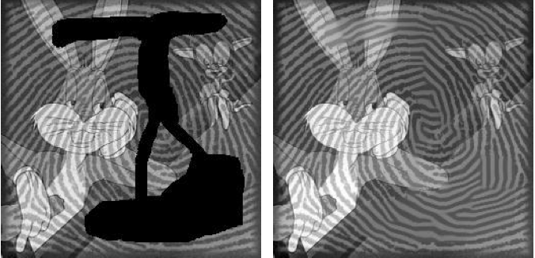

This Matlab package contains the source code to reproduce the figure of the article:

P. Maurel, J-F. Aujol, G. Peyré. [Locally Parallel Texture Modeling](https://hal.archives-ouvertes.fr/hal-00415779/). SIAM Journal on Imaging Sciences, 4(1), pp. 413–447, 2011.

- display_orientations: display instantaneous frequencies of an image
- estimate_amplitudes: try to estimate the amplitudes of the frequence in Chi
- estimate_orientations: instaneous frequencies computation
- estimate_orientations_zeropadding: compute instant frequency with zooming using zeropadding
- gabor_weights: weights for the convex norme
- non_convex_weight: build weights Chi for the non-convex norm
- test_h,test_h2,test_diff_h,test_diff_h2: functions h of the paper (rendering function) and its derivatives
- texture_synthesis: synthesize a texture from a field orientation/frequencies
- TV_Hilbert_Adapted: structure/texture decomposition using our convex norm in the noiseless case
- TV_Hilbert_Adapted_Noise: same with noise
- TV_Hilbert_Adapted_noise_non_convex: decomposition using the non convex norme
- TV_Hilbert_Inpainting: inpainting using the convex norm
- TV_Hilbert_Inpainting_non_convex: same but non convex
- TV_Inpainting: TV inpainting
- TV_L2: TV/L2 decomposition

Copyright (c) 2011 P. Maurel
